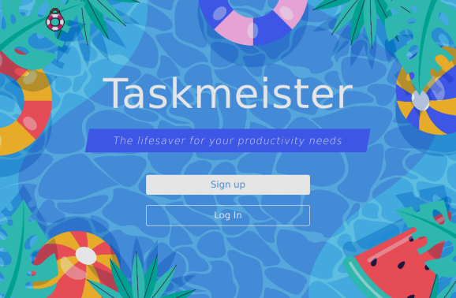

<p align="center">
        
        
        
        

</p>

<p align="center">

</p>
</br>

 <h1 align="center">Taskmeister - The lifesaver for your productivity needs</h1>

 <div align="center">
   Taskmeister is an app to help you plan recurring activities for every week or just a single task.

   With a calendar view on the weeks tasks, organize what you want to do. Build habits using this app - and learn a thing or two!

   This app was deployed using MongoDB Atlas for database handling as well as [cyclic.sh](https://cyclic.sh/) for the Node processes.
 </div>

 <p align="center"> <b>Take me to <a href="https://taskmeister.cyclic.app" target="_blank">Taskmeister</a></b></p>

---
</br>

## Project Description

### Basic Functionalities

- Create a user with password and email authentication, security question and answer
- Create a task with a title, a description - chose between a recurrence (on one or multiple weekdays for the remainder of the year) or a task that only happens once
- mark a task as done/undone
- View the weeks schedule which displays all of the current weeks tasks
- View the weeks after or before the current week
- See today's tasks on the home screen
- View a task in detail
- Edit one task or all recurrences of this task
- Delete one or all recurrences of this task

### Advanced Functionalities

- Procrastinate: postpone any given task by a day!
- Learn something new with the Random Fact API on the home screen!
- Forgot your password? Answer a security question and create a new one?
- Want a new password? Update it from the profile!
- Want to stay logged in? Don't forget to "Remember me"!
- Don't want to use the app anymore? Go ahead and delete your profile!

### Backlog

- Advanced UI design (header / footer)

---

## Technologies

This project uses Node.js, Express and MongoDB

Most important middleware functions and packages include:

- [bcryptjs](https://www.npmjs.com/package/bcryptjs)
  - hashing passwords
- [express-session](https://www.npmjs.com/package/express-session)
  - session middleware
- [connect-mongo](https://www.npmjs.com/package/connect-mongo)
  - MongoDB session store
- [axios](https://www.npmjs.com/package/axios)
  - HTTP client based on Promises
- [chartjs](https://www.chartjs.org/)
  - JavaScript charting library
- crypto
- hbs
- authentication middleware function (to discern logged-in/out states)

Base structure organization using [Ironlauncher](https://www.npmjs.com/package/ironlauncher) generator by Ironhack.

The [Random Fact API](https://api-ninjas.com/api/facts) is used to improve the user experience even further.

## Installation

After cloning the repository

```bash
git clone https://github.com/jmchor/activity_logger.git
```

install all dependencies with

```bash
npm install
```

Create a .env file specifying PORT number as well as a SESS_SECRET. If you want to use the random facts API, create a free account and save the FACT_API_KEY as an environment variable as well.

Run the app on a local machine using

```bash
npm run dev
```

or use

```bash
nodemon
```

in the projects root directory (nodemon needs to be installed as well)

---

## Project Structure

### Routes

#### Index Route

- GET /

  - Redirects the logged-in user to /home
  - Renders the login page
  - Loads the slogan array

#### Auth Routes

- GET /signup
  - renders sign-up form
- POST /signup
  - creates the user according to the User model
- GET /login
  - renders login form
- POST /login
  - finds a user, compares passwords and redirects to /home
- GET /home
  - renders the home page
- GET /profile
  - renders the profile page
- POST /logout
  - Deletes the session cookie and redirects to /login
- POST /profile/delete-account
  - compares user password and deletes the user
- GET /profile/statistics
  - receives a statistics object and renders the auth/statistics view
- POST /update-password
  - compares password hashes; uses route guard
- POST /new-password
  - updates the session.currentUsers password
- GET /find-user
  - renders the find-user view
- POST /find-user
  - identify a user by e-mail
- POST /answer
  - compares the hashed answer to the security question
- GET /reset-password/:id
  - renders reset-password form with user object
- POST /reset-password/:id
  - resets the users password

#### Activity Route

- GET /create
  - renders the create-activity form
- POST /create
  - creates a new activity and redirects to /home
- GET /schedule/:id
  - renders activity detail view and form
- POST /schedule/:id
  - Edits an activity according to the input data
- DELETE /schedule/:id
  - deletes an activity after password comparison

#### Schedule Routes

- GET /schedule
  - renders the weekly schedule with objects containing activity and date data
- POST /schedule
  - finds an activity and sets the isDone property to "true"

### Models

#### User

```javascript
username: {
      type: String,
      trim: true,
      required: false,
      unique: true
    },
    email: {
      type: String,
      required: true,
      match: [/^\S+@\S+\.\S+$/, "Please use a valid email address."],
      unique: true,
      lowercase: true,
      trim: true
    },
    password: {
      type: String,
      required: true
    },
    securityQuestion: {
      type: String,
      required: true,
    },
    passwordResetAnswer: {
      type: String,
      required: true,
    },
    activities: [
      {
      type: Schema.Types.ObjectId,
      ref:"Activity"
    }]
```

#### Activity

```javascript
userId: {
   type: Schema.Types.ObjectId,
   ref: 'User',
  },
  title: {
   type: String,
   required: true,
  },
  description: {
   type: String,
   required: true,
  },
  category: {
   type: String,
  },
  isDone: {
   type: Boolean,
   required: true,
   default: false,
  },
  daysOfWeek: [
   {
    type: String,
    enum: ['Monday', 'Tuesday', 'Wednesday', 'Thursday', 'Friday', 'Saturday', 'Sunday'],
   },
  ],
  repeat: {
   type: String,
   enum: ['weekly', 'once'],
   default: 'once',
  },
  specificDate: {
   type: Date,
   required: function () {
    return this.repeat === 'once';
   },
  },
  groupId: {
   type: String,
   default: '',
  }
```

---

### Trivia

In order to cut loading times for the **Random Fact API** call down to a minimum, we followed a "get many, show one" approach: the API call fetches *as many facts as possible*, while **only one** gets shown on page load. When there are no more facts - new ones will be fetched.

___

</br>
<h2 align="center"> Contributors </h2>

</br>

<div align="center">
  <a href="https://github.com/jmchor/activity_logger/graphs/contributors" >
    
    
    
  </a>
</div>

</br>

<p align="center">This project was realized by <a href="https://github.com/jmchor">Johannes Chorzempa</a>, <a href="https://github.com/nncht" target="_blank">Nana Chuto</a> & <a href="https://github.com/lukasmerlin" target="_blank">Lukas Jürgens</a> for the second module of Ironhack Bootcamp.</p>

<p align="center"><a href="https://www.flaticon.com/authors/basic-miscellany/blue?author_id=159&type=standard" title="Icons bz Smashicons">Basic Miscellany Blue </a>created by Smashicons</p>
